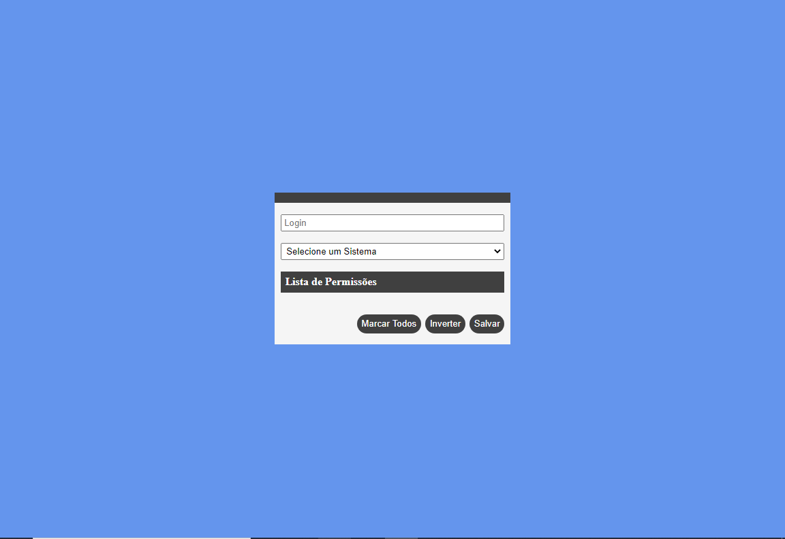

<h1 align="center">
  Cadastro De Permissões
</h1>

 
  Fazendo uso de JavaScript com TypeScript eu elaborei um "microservice",
  usando queries nativas(sem ORM), e a interface foi desenvolvida com HTML,
  CSS e Javascript(sem Frameworks). A aplicação permite a escolha de um
  sistema cadastrado ex: "Gerenciamento de Usuarios", e com isso determinar
  as permissões de qualquer usuario cadastrado.   

## Aplicação

### Home 

    

###  Lista de Permissões

    

## Funcionalidades

* Autenticação de usuário;

* Listagem de sistemas cadastrados;

* Listagem de permissões;

* Inserir dados na tabela de permissões/Apagar dados na tabela de permissões.

## Para rodar a aplicação

  * A primeira coisa é executar o comando yarn ou npm install,
  para instalar todas as dependencias necessárias para rodar o
  servidor, execute um dos comandos apenas na pasta Server.

  * Entre em "src/database/config" aqui você pode escolher rodar com o docker ou postgre local adicionando as suas informações lembre de criar o banco de dados pelo pgAdmin, para criação das tabelas use "yarn created", já para inserir dados "yarn insert", para rodar todos os microservices "yarn start";

  * Após isso para usarmos a interface, entre na pasta web e use o comando "httpster -p 3000" (se você não tiver o httpster instalado execute "npm -g install httpster" ou "yarn add httpster -g" ).

## Tecnologias

  * NodeJS (Back-End);

  * HTML,CSS, JavaSript (Web Front-End);

  * PostgreSQL (Banco de Dados);

  * httpster (Usado para executar todo o conteúdo em um servidor local);

  * pg (Efetuar queries nativas do Postgres no Node).

